# Harvest Architecture

## System Overview

```mermaid
flowchart TB
    subgraph "Data Ingestion"
        direction TB
        SEED["🌐 Seed URLs"]
        CRAWLER["Crawler"]
        FRONTIER["URL Frontier<br/>(mpsc channel)"]
        FETCHER["HTTP Fetcher<br/>(reqwest + Semaphore)"]
        PARSER["HTML Parser<br/>(scraper)"]
    end

    subgraph "Text Processing"
        direction TB
        ANALYZER["Text Analyzer"]
        subgraph "Analysis Pipeline"
            CHAR_FILTER["Character Filters<br/>• HTMLTagFilter"]
            TOKENIZER["Tokenizer<br/>• WhiteSpaceTokenizer"]
            TOKEN_FILTER["Token Filters<br/>• LowerCase<br/>• Punctuation Strip<br/>• Stop Words<br/>• Numeric Filter<br/>• Porter Stemmer"]
        end
    end

    subgraph "Indexing Engine"
        direction TB
        INDEXER["Indexer"]
        TOKEN_STREAM["Token Stream<br/>(mpsc channel)"]
        SPIMI["SPIMI Invert<br/>(in-memory blocks)"]
        DISK_BLOCKS["Disk Blocks<br/>(JSON files)"]
        MERGE["K-Way Merge<br/>(MinHeap)"]
    end

    subgraph "MongoDB Storage"
        direction TB
        PAGES_COLL[("pages<br/>collection")]
        INDEX_COLL[("inverted_index<br/>collection")]
    end

    subgraph "Query Engine"
        direction TB
        QUERY_ANALYZER["Query Analyzer"]
        INDEX_LOOKUP["Index Lookup"]
        INTERSECT["Positional Intersect"]
        RESULTS["Result Doc IDs"]
    end

    subgraph "REST API"
        direction TB
        AXUM["Axum Server"]
        SEARCH_API["/api/search"]
        STATIC["Static UI<br/>(HTML/CSS/JS)"]
    end

    USER["👤 User"]

    %% Data Ingestion Flow
    SEED --> CRAWLER
    CRAWLER --> FRONTIER
    FRONTIER --> FETCHER
    FETCHER --> PARSER
    PARSER --> PAGES_COLL
    PARSER -.->|"outgoing links"| FRONTIER

    %% Indexing Flow
    PAGES_COLL -->|"unindexed pages"| INDEXER
    INDEXER --> ANALYZER
    ANALYZER --> CHAR_FILTER --> TOKENIZER --> TOKEN_FILTER
    TOKEN_FILTER --> TOKEN_STREAM
    TOKEN_STREAM --> SPIMI
    SPIMI -->|"memory limit"| DISK_BLOCKS
    DISK_BLOCKS --> MERGE
    MERGE --> INDEX_COLL

    %% Query Flow
    USER --> STATIC
    STATIC --> SEARCH_API
    SEARCH_API --> AXUM
    AXUM --> QUERY_ANALYZER
    QUERY_ANALYZER --> ANALYZER
    INDEX_LOOKUP --> INDEX_COLL
    QUERY_ANALYZER --> INDEX_LOOKUP
    INDEX_LOOKUP --> INTERSECT
    INTERSECT --> RESULTS
    RESULTS --> PAGES_COLL
    PAGES_COLL --> AXUM
    AXUM --> USER
```

## Component Details

### Crawler
- **Concurrent fetching** with configurable semaphore limits
- **BFS traversal** with depth tracking
- **Deduplication** via DashSet (concurrent HashSet)
- Respects non-HTML content types

### Text Analyzer Pipeline

| Stage | Components |
|-------|------------|
| Character Filters | `HTMLTagFilter` - strips tags, extracts text |
| Tokenizer | `WhiteSpaceTokenizer` - splits on whitespace |
| Token Filters | `LowerCase`, `PunctuationStrip`, `StopWord`, `Numeric`, `PorterStemmer` |

### Indexer (SPIMI Algorithm)

- **Memory-bounded**: Flush to disk when memory budget exceeded
- **Incremental indexing**: Only processes unindexed pages
- **Position tracking**: Stores term positions for phrase queries

### Query Engine

- **Phrase queries**: Uses positional intersection with k-distance matching
- **Multi-term queries**: Intersects posting lists starting from shortest

### Data Models

## Technology Stack

| Layer | Technology |
|-------|------------|
| Language | Rust |
| HTTP Client | reqwest |
| HTML Parsing | scraper, html5ever |
| Stemming | porter_stemmer |
| Database | MongoDB |
| Web Framework | Axum |
| Async Runtime | Tokio |
| Frontend | Vanilla HTML/CSS/JS |
